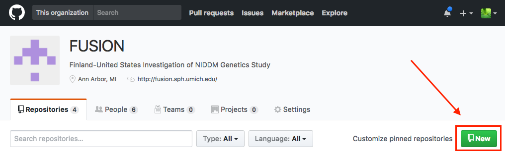

# FUSION Github Strategy

## Organization
Code will be stored in repositories under the FUSION github organization, located here:

https://github.com/fusion-study

Please send an email to [Ryan](mailto:welchr@umich.edu) or [Peggy](mailto:ppwhite@umich.edu) if you need an invite.

## Permissions
Currently everyone in FUSION can read all repositories by default. You need to specifically give people write permission on repositories you create. Since we're relatively small, we can likely just add each person as needed. Teams can also be created as well.

## Repositories
### Creating
First, create your local repository doing the usual:

```
git init
touch README.md
git add README.md
git commit -m "Start of repository"
```

Now create a repository to push to on the [github organization](https://github.com/fusion-study). Hit the "New" button in the upper-right:



You should see:


Choose any name for your repository. Perhaps include a prefix if this repository belongs to a larger project. For example `tissue-eqtl-analysis` and `tissue-methylation`. You likely **do not** want to include version, freeze, or date in your repository name - these bits of information are all easy to put in the repository itself as you will see below.

The other defaults are likely what you want. Start with a private repository (you can make it public later.) **Don't** initialize repository with a README or a .gitignore file - you will add these yourself later, and they will cause an error when you push your local repository for the first time.

Once you create the repository, now you should see:


I did this on my own github account, so the links will have "welchr" in them, your links will be different.

You want the second block **.. or push an existing repository from the command line**. Go back to your machine/server where you created your local repository and enter those commands. Your code is now pushed to the Github repository. Refresh the page and you should see your code now.

### Committing changes to code

As you work on your project, you can stage your files by doing:

```
git add some_dir/myfile.txt
```

This adds the file (or the changes in the file, if it was previously added before) to git's index. Now you can do:

```
git commit
# or git commit -m 'message'
```

An easy shortcut if you don't want to stage files every single time they've changed is to use `-a` when committing, like `git commit -am 'my changes'`.

The reason you may want to git add files separately, rather than using `git commit -a`, is that you may want to add changes made in different files as separate commits. Typically you want to try and make each commit a small self-contained change that would make sense to rollback if you needed to. Commits with large sweeping amounts of changes across multiple files can sometimes be difficult to reason about when it comes to selectively rolling back or removing changes.

### Pushing changes to Github

If you've followed the instructions above, your repository is already set to push changes to github. After making a commit (or you could wait until you've made multiple commits if you'd like), you just:

```
git push
```

And your changes will be sent to github.

### More advanced usage

So far this just assumes you have one repository, and isn't concerned with branches or other more advanced git features. You can learn more by checking out some online git tutorials:

https://git-scm.com/book/en/v2
https://www.atlassian.com/git/tutorials
http://csg.sph.umich.edu/welchr/lab/intro-to-git

## Larger projects/papers
Our papers in the past have been typically been individual analysts (or very small groups) working on each analysis that ended up in the paper. There are a couple of options for this type of workflow.

### Workflow 1: master project repository + multiple analysis repositories

Each analyst (or small team) maintains their own repository per analysis. This results in maybe 5-10 repositories per paper. We create one "master" repository that represents the paper, and the maintainer of that repository will pull in changes from each of the repositories that represent the paper analyses during freezes.

Advantages:
	* Easier for analysts, since it's (mostly) single-developer workflow.
	* Don't need to know anything about branches, or merging. Just commit your changes to your project and push them to github.

Disadvantages:
	* Multiple repositories that clutter up the organization (not so bad really.)
	* Need to know which repository is the master/paper one.
	* Maintainer needs to understand git subtrees.

Typical workflow:
	1. Analysts create repositories and push them to github as usual (see above.)
	2. A maintainer creates a master repository for the entire project, for example "muscle-paper-2017".
	3. Periodically at paper freezes, the maintainer would pull the other repositories in:

```
# First-time setup: add remotes
git remote add fume git@github.com:fusion-study/FuMe.git
git remote add gwas_db git@github.com:fusion-study/gwas_database.git

# First-time setup: merge in subtrees
git subtree add --squash --prefix gwas_db/ gwas_db master
git subtree add --squash --prefix fume/ fume master

# In the future, during a freeze:
git subtree pull --squash --prefix gwas_db/ gwas_db master
git subtree pull --squash --prefix fume/ fume master

# Tag this version
git tag -a "1.0" -m "Release 1.0 (ASHG 2017)"
```

### Workflow 2: one repository

One repository for the paper, and all analysts commit their work on separate branches, which later can be merged into the master branch during freezes.

Advantages:
	* Single repository, everything in one place.

Disadvantages:
	* Requires understanding of branching/merging. Someone with write access could potentially push on the wrong branch, or to master, and disrupt others.
	* Commit/branch history gets pretty ugly. Which is okay as long as you don't look at it...

Typical workflow:
	1. User clones the central repository by doing:

	`git clone <repository URL>`

	2. Create a new branch to work on:

	`git checkout -b my_analysis`

	3. Setup your branch to push changes to Github:

	`git push --set-upstream origin my_analysis`

	4. Commit changes as usual, either with `git commit -a` or manually stage each of your files and commit, like:

```
# You probably want to make a subdirectory to work under for your particular analysis
mkdir eqtl_analysis
touch eqtl_analysis/my_script.py
git add eqtl_analysis/my_script.py
git commit -m "My changes are..."
```

	5. Later, maybe after a few more commits, push your changes back to github by doing `git push`.

	6. During a paper or version freeze, the repository maintainer can merge each branch into master.

```
git checkout master
git merge project1_branch project2_branch project3_branch
git tag -a "1.0" -m "Release 1.0 - ASHG 2017"
```

## Software
Software should be stored in separate repositories. This makes it easier for others in the community to submit changes they make to the code (pull requests), and to track issues/bugs.

If the software was specifically written for an analysis of a paper, it could be included in the paper repository using a subtree merge.

## Large files
In general it isn't a great idea to commit large files to repositories. Github also has a limit of 1GB per repository, and individual files cannot exceed 100 MB.

One way around this is to separately store the large files somewhere, perhaps on snowwhite somewhere under `/home/FUSION/`. Then provide instructions for how to grab those files. For example, you could include this command in your README, or a script in your repo:

```
# Remove --dry-run after running this command to verify the paths look correct
rsync -aviH --progress --dry-run \
  user@snowwhite:/home/FUSION/my_analysis/ \
	/path/to/local/my_analysis/
```

Versioning data in this way needs to be done manually, unfortunately. You could name files by their version, or directories.

### Notes for future improvement

Some possible tools for getting a better handle on distributing/versioning data:

	* [git annex](https://git-annex.branchable.com/tips/centralized_git_repository_tutorial/on_GitHub/)
	* [git lfs](https://git-lfs.github.com/)
	* [dat](https://github.com/datproject/dat)
	* [borg](https://borgbackup.readthedocs.io/en/stable/quickstart.html)

Git LFS seems like the worst of the possible options, I only mention it to remind us take another look again in the future.

Dat looks like a great way to share data, and it is secure, but there is no versioning built in.

Borg is pretty great: it is secure, de-duplicates and versions data automatically, the repository with all versions of the data is easy to transfer (just copy it). The downside is the learning curve, and that it stores files in its own binary format, so inspecting the archives always requires the use of CLI tools (which must also be installed separately, though this is trivial.)

## Updating git
The newer versions of git make a number of quality of life improvements. You can update to a newer version of git on linux by using [linuxbrew](https://linuxbrew.sh) or on Mac by using [homebrew](https://brew.sh/). There are also some pre-compiled [git installers](https://git-scm.com/downloads) available as well.

## FAQ
Will fill this in as questions come up.
